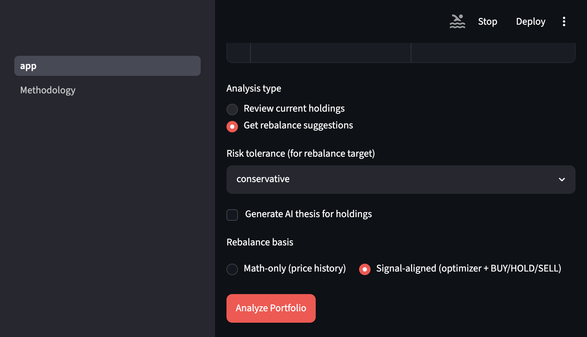
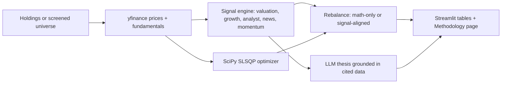

# AI Portfolio Advisor

Python + Streamlit app for screening large-cap stocks, mean–variance optimization (SciPy SLSQP), holdings analysis, auditable BUY/HOLD/SELL signals, and optional LLM investment theses. Built as a free public research demo with API keys isolated to environment variables and Streamlit secrets.

**Live demo:** _Add your Streamlit Community Cloud URL here after deploy._



## Features

- **Build New Portfolio** — screen a large-cap universe, optimize weights, save to SQLite locally
- **Analyze My Portfolio** — sector concentration, portfolio risk label, rebalance suggestions, five-part signal breakdown, optional AI theses
- **Rebalance modes** — **Math-only** (optimizer targets) vs **Signal-aligned** (tilt toward BUY/HOLD/SELL with per-position caps)
- **Methodology page** — how signals, optimization, and rebalance modes relate ([`portfolio_advisor/pages/2_Methodology.py`](portfolio_advisor/pages/2_Methodology.py))
- **Optional Webull import** (local only — see [Deploy](#deploy-to-streamlit-community-cloud))
- **Optional Finnhub** enrichment for Mode 2 theses
- **LLM theses** — Groq (default) or Anthropic; rule-based risk summaries in the UI
- **Thesis cache** (7 days) and **rate limiting** (5 build/analyze actions per hour per client, SQLite-backed)

**Stack:** Python, SciPy, Groq and Anthropic APIs, Streamlit, yfinance, Plotly.

## How it works



## Quick start

```bash
git clone https://github.com/jomiarockiasamy/AI-Portfolio-Advisor.git
cd AI-Portfolio-Advisor
python3 -m venv .venv
source .venv/bin/activate
pip install -r portfolio_advisor/requirements.txt
cp .env.example .env   # edit with your keys — never commit .env
streamlit run portfolio_advisor/app.py
```

See [`portfolio_advisor/README.md`](portfolio_advisor/README.md) for environment variables, Webull/Finnhub notes, and module map.

## Tests

```bash
pip install -r portfolio_advisor/requirements.txt
pytest -q
```

GitHub Actions runs the same suite on push/PR (`.github/workflows/ci.yml`).

## Deploy to Streamlit Community Cloud

1. Push this repo to GitHub. Root `.gitignore` excludes `.env`, `conf/`, `*.log`, and `*.db`.
2. [share.streamlit.io](https://share.streamlit.io) → **New app** → main file: `portfolio_advisor/app.py`.
3. In **Secrets** (not in code), set at minimum:

```toml
GROQ_API_KEY = "your_key"
```

Optional: `ANTHROPIC_API_KEY`, `LLM_PROVIDER`, `FINNHUB_API_KEY`.

**Do not add Webull app keys to a public Streamlit app.** Webull credentials can read or affect brokerage-linked data; keep them in local `.env` only. The public demo should use manual holdings entry.

4. Paste the live app URL at the top of this README.

## Limits

- **Educational / research only — not financial advice.** No trade execution; no brokerage relationship.
- **Expected returns** come from historical means — noisy; thin history falls back to equal weights with a warning.
- **Thesis signals and Math-only rebalance can disagree.** Signals score fundamentals, news, analyst views, and momentum. The optimizer maximizes expected return minus a risk-aversion penalty on variance, using two years of price history. Use Signal-aligned rebalance to tilt targets toward the signals, or read both side by side.
- **Streamlit Cloud** uses ephemeral disk — saved portfolios and thesis cache reset on cold start (documented in [`portfolio_advisor/README.md`](portfolio_advisor/README.md)).

## Project layout

```
portfolio_advisor/   # Streamlit app and engines
tests/               # pytest (optimizer, rebalance caps, formatters)
docs/                # screenshot for README
```
